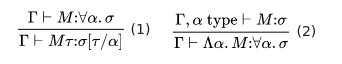

# Lambda Calculus

Implementing Simply Typed Lambda Calculus in OCaml.

To run the interpreter run

```console
foo@bar:~$ nix-shell --max-jobs auto
```

Then use dune to build/run

If you don't want to use nix then add the dependencies to opam manually I suppose.

Lastly to see examples of the interpreter go to the test directory, there are ppx tests there.

## Examples of functions in System F

1. $(\lambda id:\forall x.x \rightarrow x.id)$ this is interpreted as $(\forall x.x \rightarrow x \rightarrow \forall x.x \rightarrow x)$. Already we have polymophism, this is a identity function. A identity function just returns the argument, since it's polymorphic, that can be a string, int, double, etc.

2. $(\lambda x:T \rightarrow T.x)$ which is typed to: $((T \rightarrow T) \rightarrow T \rightarrow T)$

3. $((\Lambda a.\lambda :a \rightarrow a.x) \space [int])$ which is typed to: $((int \rightarrow int) \rightarrow int \rightarrow int)$, we have now narrowed the type from a polymorphic one to a explicit one. We pass a type in a similar way we do a normal arugment! It's a function that takes a type as its argument.

## What is lambda calculus?

In some sense lambda calculus is the simplest programming language, while being turing complete. The simplest form of lambda calclus is performed by constructing [lambda terms](https://en.wikipedia.org/wiki/Lambda_calculus#Lambda_terms) and performing [reduction](https://en.wikipedia.org/wiki/Lambda_calculus#Reduction) operations on those terms.

### Rules

The terms follow simple rules:

- A variable is a character or string.
- $(\lambda x. B)$: A [lamba abstraction](https://en.wikipedia.org/wiki/Lambda_calculus#lambdaAbstr), essentially just a anonymous function. Where $\lambda$ denotes the creation of a function, x is the parameter and dot as a seperator. Followed by the function body, in this case B (eg. B could be x+2). The simplest begin $\lambda x.x$ which is also called the identity function.
- $(B \space A)$: An [application](https://en.wikipedia.org/wiki/Lambda_calculus#anApplic), apply function body B to an argument A. Both B and A are lambda terms.

There are also reduction operators rules:

- ${\textstyle (\lambda x.B[x])\rightarrow (\lambda y.B[y])}$ : Looks scary but all it really says is that changing the variable names (bound variables!) within a function has only a "symbolic" effect. $(\lambda x. x)$: == $(\lambda y. y)$. Here, x and y are bound variables (think parameters). They are just placeholders and thus, changing its name has no side effect.

- ${\textstyle ((\lambda x.B)\ A)\rightarrow (B[x:=A])}$: Again, scary, it just means "calculate the functions by substituting the input placeholders with the input". The function $(\lambda x. \space x+5)3$ is calculated by applying the 3 to the function (reduction). It works like simplifying any other equation, simplify until you can't! So lets simplify:

    1. $(\lambda x. \space x+5)3$
    2. $(3 + 5)$
    3. $8$

### Currying

Haskell enjoyer? skip this part, otherwise:

Try to understand what is happening here: $(\lambda x. \space (\lambda y. \space x+y))$. The function body (B) of $\lambda x.$ is another function! It's a quirk where we only have one bound variable and if we need more than one, we curry! lets use JS to illuminate

```js
    const add = (x) => {
        return (y) => {
            return x + y
        }
    }

    //Now what happens if we call:
    console.log(add(5))
    //What do we actually get back? The answer is a new function.
    console.log(add(5)(4)) // => prints 9
    // add(5) returns a function which we then apply with 4
```

This is important to understand becuase, otherwise, this will make no sense:

$\lambda xyz. \space x+y+z = \lambda x. \space (\lambda y. \space (\lambda z. \space x+y+z))$

This is currying, a haskell function signature might look like:

```haskell
Add :: Int -> Int -> Int
```

This means, take two parameters of type ```Int``` and return a new value of type ```Int```. But! we are not taking two parameters in the same sense as add(5,4) as you might be familiar with. The haskell function is curried automatically. Under the hood, the function type signature is like this:

```haskell
Add :: Int -> (Int -> Int)
```

It's a function that takes *one* parameter ```Int``` and another function which takes the second parameter. The same holds true in lambda calulus, functions are curried.

### Numbers

There isn't really a notion of numbers in lambda calulus in the same way as you might expect in a language like JS. This is why in lambda calculus we need [church encoding](https://en.wikipedia.org/wiki/Church_encoding). this encoding is how data is represented in lambda calculus. To represent natural numbers we apply a function n times to get n. Lets illustrate with a table:

| Number | Function definition | Lambda expressoion |   |   |
|--------|---------------------|--------------------|---|---|
| 0      | f x = x             | $\lambda f. \lambda x. x$
| 1      | f x = f x           | $\lambda f. \lambda x. fx$
| 2      | fx = f (f x)        | $\lambda f. \lambda x. f (f x)$
| 3      | fx = f (f (f x))    | $\lambda f. \lambda x. f (f (f x))$
| ...    | ...                 | ...

As you can see, we denote natural numbers by actually representing it as "n times applying". 3 represents the action of applying any function 3 times.

### Recursion

In JS you could write a simple recursive function to calculate factorial:

```javascript
const factorial = (x) => {
    if (x==0) return 1
    return x * factorial(x - 1)
}

//Running this yields 120 as you'd expect.
console.log(factorial(5));
```

We can also do recursion in lambda calculus, however, there's no notion of a "named" function or any way to refer to the "same" function. Lets define "same" as the same function pointer in memory. Instead in lambda calcus we perform recursion by calling a identical function (altough not the "same"):

$(\lambda x. \space x \space x) (\lambda x. \space x \space x)$

If we try to perform reduction on this lambda term we get:

1. $(\lambda x. \space x \space x) (\lambda x. \space x \space x)$
2. $(\lambda x. \space x \space x) \space x \space x$
3. $(\lambda x. \space x \space x) (\lambda x. \space x \space x)$
4. $(\lambda x. \space x \space x) \space x \space x$
5. ...

And there we have recursion, it's kind of useless and to get recursion that changes between steps we use [Fixed-point combinator (Y-combinator)](https://en.wikipedia.org/wiki/Fixed-point_combinator#Y_combinator).

## Simply Typed Lambda Calculus

There are rules:
[](https://en.wikipedia.org/wiki/Simply_typed_lambda_calculus)

We really just want to introduce the notion of an arrow in the type system. For example, a function with type int -> int represents a function from integers to integers

## System F

Finally, after implementing lambda calculus and simply typed lambda calculus, we can now implement System F. Which adds two more typing rules on top of simply typed lambda calculus and is also the base for languages such as Haskell. System F allows for polymorphism (terms that take types as arguments), eg. sort_list: ($\forall$ X.)  (X -> X -> bool) -> list(X) -> List(X). You are probably more familiar with concepts such as List<$T$> instead (It's atleast conceptually similar).

The new rules are as follows:

[](https://en.wikipedia.org/wiki/System_F)

Further reading and clarification:

[System F introduction](https://citeseerx.ist.psu.edu/document?repid=rep1&type=pdf&doi=012167a7425645478e5a00cb3c75f199815dffa5)

[A more formal overview](http://www.cs.columbia.edu/~sedwards/classes/2023/6998-spring-tlc/systemf.pdf).

Sometimes Kinds are included in System F, we will not be. Kinds are sort of functions at the type level. A popular example would be "Maybe". In Haskell Maybe would have kind * -> *, eg. a type level function, a type constructor. Maybe is not an value, but Maybe Int is.
